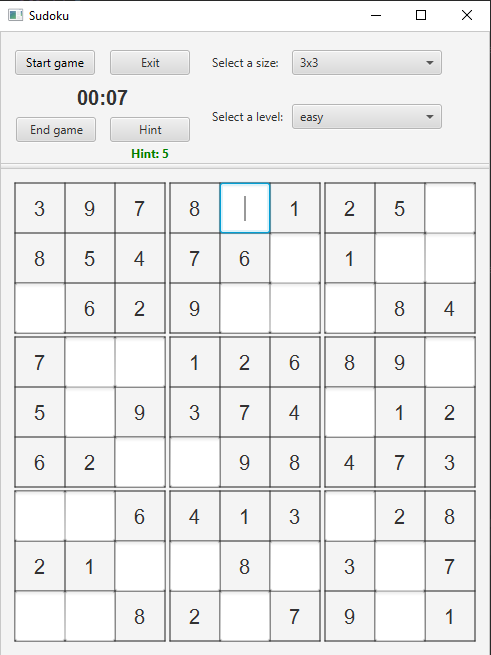
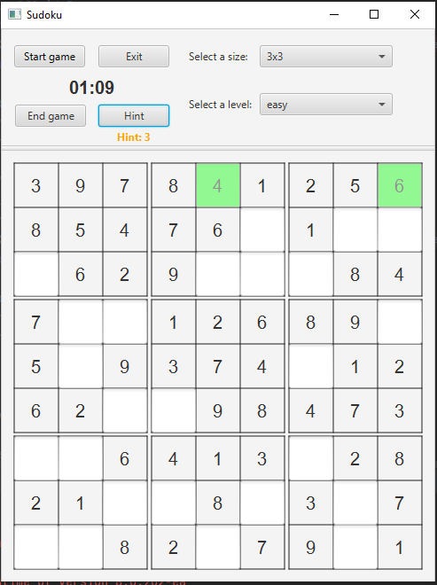
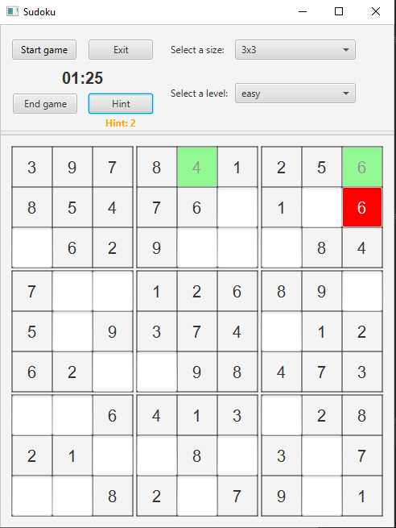
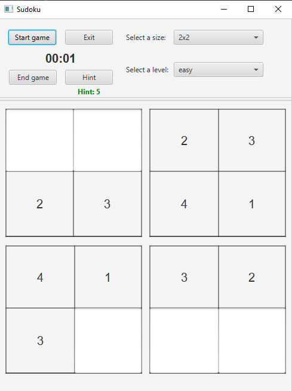
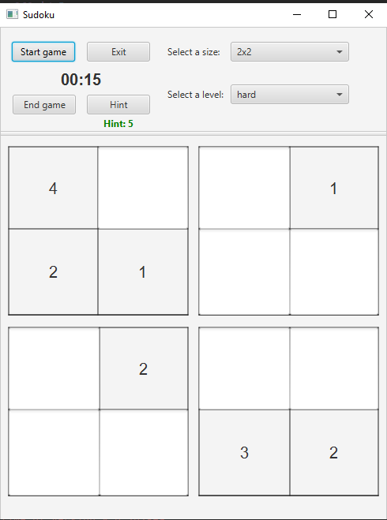

# Sudoku written in JAVA

Sudoku game written in JAVA with JavaFX technology.

The GUI of application has been written with JavaFx technology.
The sudoku board is create with a simple brute force algorithm. The player can choose a size of the board and the level of the game. 
Created sudoku board can be fill only in one way.
Hint system - the player has 5 hints. Clicking the hint button cause that depends on what digit player put inside, the field is mark by proper color. Correct is mark by green, incorrect is mark by red.

## requirements: 

1. Java in 1.8 version

## DEMO

